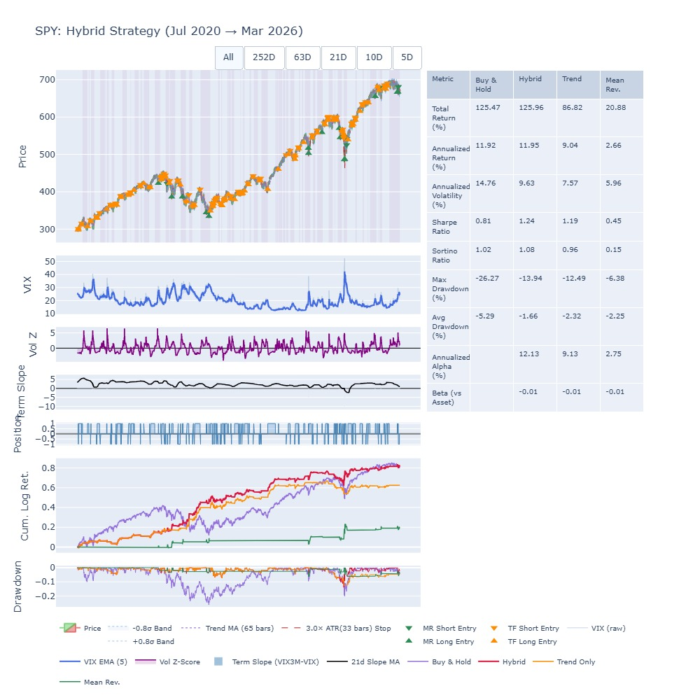
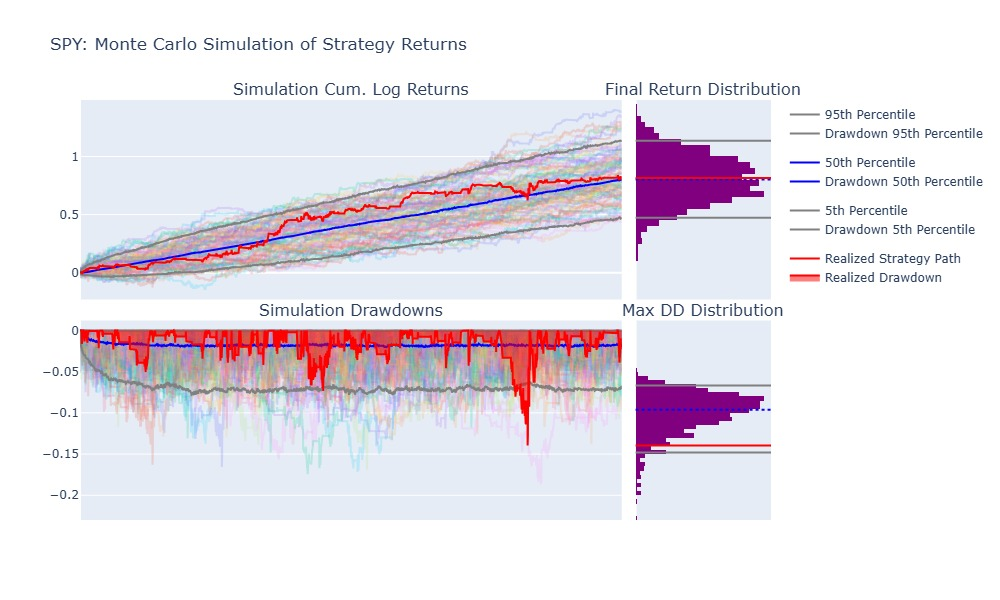
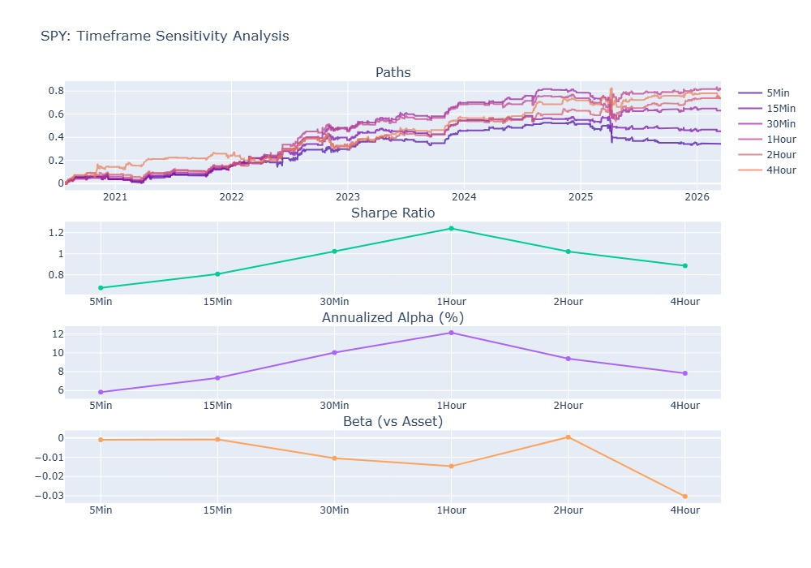
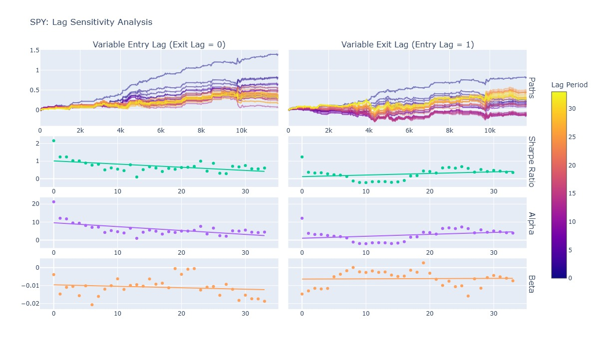
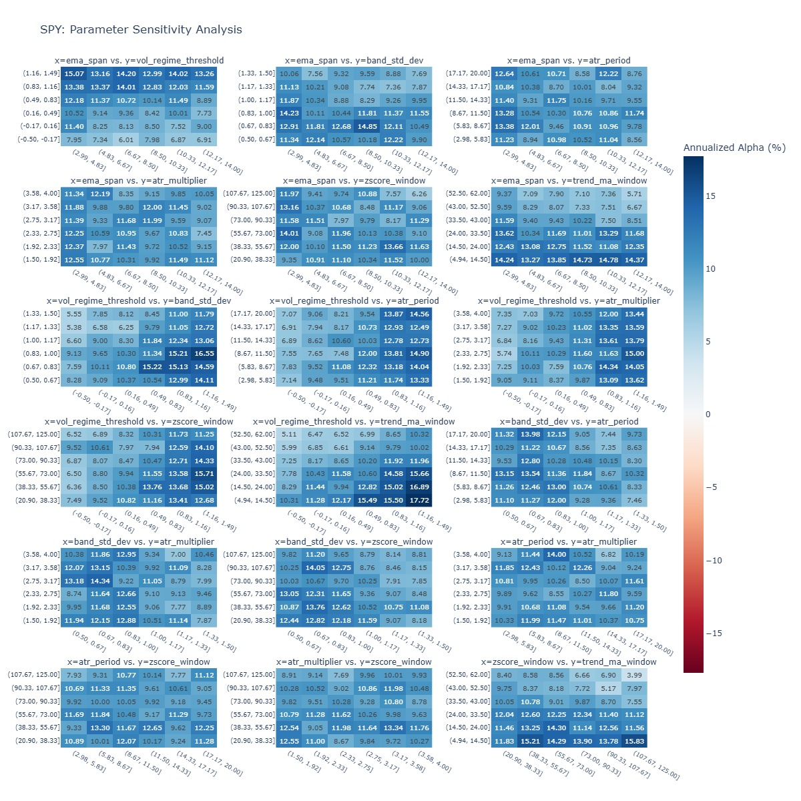

# VIX Regime-Adaptive Trading Strategy: Backtesting and Research

## Overview

This report summarises the backtested performance of a Hybrid Strategy applied to **SPY**, combining trend-following (TF) and mean-reversion (MR) components. The strategy is evaluated across multiple dimensions: raw performance, robustness to parameter and lag choices, sensitivity to execution timeframe, and Monte Carlo stress testing.

## Strategy Logic

The core idea is a **regime-conditional switching strategy**:

- **Low volatility regime → Trend Following**: When markets are calm and trending, the strategy rides momentum using a moving-average crossover with ATR-based stops.
- **High volatility regime + VIX backwardation → Mean Reversion**: When markets are stressed (elevated vol z-score) _and_ the VIX term structure is in backwardation (VIX3M < VIX spot, i.e. `use_stress_flag = True`), the strategy fades moves using VWAP-anchored Bollinger Bands, expecting a snap-back.

The regime switch is governed by a **volatility z-score** relative to a rolling EMA baseline. Crossing `vol_regime_threshold = 0.0` (i.e. vol above its own historical mean) triggers the high-vol branch, but only if the term structure condition is also met — avoiding false positives during high-vol trending markets.

### Hyperparameters

```python
strategy_params = StrategyHyperparams(
    timeframe = TIMEFRAME,
    # ── Vol regime parameters ────────────────────────────────────────────────
    band_std_dev         = 0.8,   # Bollinger Band width (MR entry threshold)
    ema_span             = WEEK,  # EMA baseline for vol regime detection
    zscore_window        = MONTH, # Rolling window for vol z-score
    vol_regime_threshold = 0.0,   # Z-score above this → high vol regime
    use_stress_flag      = True,  # Require VIX backwardation for MR activation
    # ── VWAP anchor control ──────────────────────────────────────────────────
    anchor_recompute = 1,         # Recompute VWAP anchor every bar
    # ── Trend following parameters ───────────────────────────────────────────
    trend_ma_window = 2 * WEEK,   # MA window for trend signal
    # ── Risk parameters ──────────────────────────────────────────────────────
    atr_period     = WEEK,        # ATR lookback for stop sizing
    atr_multiplier = 3.0,         # Stop distance = 3× ATR
)
```

### Regime Decision Flow

```
Vol Z-Score > 0.0 ─┬─ YES ─ VIX in backwardation? ─┐
                   │                               ├─ YES ─┬─ Mean Reversion
                   │                               │       └─ fade VWAP band extremes, ±0.8σ, 3× ATR stop
                   │                               └── NO ─┬─ Don't Trade
                   │                                       └─ wait for clearer regime signal
                   └── NO ─ Trend Following (2-week MA signal)
```

**Key design choices:**

- The `band_std_dev = 0.8` is deliberately tight — the strategy enters early on vol spikes rather than waiting for extended dislocations.
- `atr_multiplier = 3.0` with a weekly ATR period gives stops that are wide enough to survive intraday noise but not catastrophic drawdowns.
- Requiring _both_ high vol z-score _and_ backwardation prevents the MR strategy from fighting strong vol-driven trends (e.g. a slow grinding bear market where vol is elevated but contango persists).

## 1. Strategy Performance



### Key Metrics

| Metric                    | Buy & Hold | Hybrid     | Trend Only | Mean Rev. |
| ------------------------- | ---------- | ---------- | ---------- | --------- |
| Total Return (%)          | 125.47     | 125.96     | 86.82      | 20.88     |
| Annualised Return (%)     | 11.92      | 11.95      | 9.04       | 2.66      |
| Annualised Volatility (%) | 14.76      | 9.63       | 7.57       | 5.96      |
| Sharpe Ratio              | 0.81       | **1.24**   | 1.19       | 0.45      |
| Sortino Ratio             | 1.02       | **1.08**   | 0.96       | 0.15      |
| Max Drawdown (%)          | -26.27     | **-13.94** | -12.49     | -6.38     |
| Annualised Alpha (%)      | —          | **12.13**  | 9.13       | 2.75      |
| Beta (vs Asset)           | —          | -0.01      | -0.01      | -0.01     |

### Observations

- The **Hybrid strategy** matches Buy & Hold total return (~126%) while nearly **halving volatility** (9.6% vs 14.8%) and **max drawdown** (-13.9% vs -26.3%).
- A **Sharpe ratio of 1.24** is materially better than Buy & Hold (0.81), demonstrating superior risk-adjusted returns.
- Near-zero beta confirms the strategy's returns are **largely market-neutral** in nature.
- The Trend-Only component contributes most of the alpha; Mean Reversion adds modest diversification.

## 2. Monte Carlo Simulation



Bootstrap Monte Carlo simulation (resampled returns) assesses the strategy's distributional robustness.

### Observations

- The **realised strategy path (red)** tracks slightly below the 50th percentile of simulated paths — suggesting the historical period was modestly unfavourable relative to the average outcome.
- The **final return distribution** is tightly concentrated; the realised outcome sits well within the range of simulations.
- **Realised max drawdown (~-13%)** is in the upper (worse) tail of the max drawdown distribution, around the 90th percentile — indicating the strategy experienced somewhat elevated drawdown relative to simulated expectations.
- Despite this, the simulated drawdown 50th percentile is only ~-5%, and **most simulated paths remained well above -10%**, confirming the tail risk is manageable.

## 3. Timeframe Sensitivity



The strategy was tested across six intraday/session timeframes: 5Min, 15Min, 30Min, 1Hour, 2Hour, and 4Hour.

### Observations

- **Sharpe ratio peaks at the 1-Hour timeframe (~1.25)** and remains strong at 2H and 4H. Shorter timeframes (5Min, 15Min) show lower Sharpe, likely due to noise.
- **Annualised Alpha also peaks at 1H (~11–12%)**, declining at both extremes. The 30Min–2Hour range represents a sweet spot.
- **Cumulative log return paths** are tightly clustered across all timeframes, indicating the strategy's directional character is consistent.
- **Beta becomes slightly more negative at 4H** (-0.03), suggesting slightly more mean-reversion character at longer bars.
- The **1-Hour timeframe** appears optimal based on both Sharpe and Alpha.

## 4. Lag Sensitivity



This analysis tests how sensitive results are to execution delay — varying **entry lag** (with exit lag fixed at 0) and **exit lag** (with entry lag fixed at 1).

### Observations

- **Variable Entry Lag**: The Sharpe ratio starts above 1 at lag = 0 and declines gracefully to ~0.5–0.6 at lag = 30. Alpha follows a similar declining but positive trend. This is expected — faster execution captures more of the signal.
- **Variable Exit Lag**: Exit lag has a smaller impact on Sharpe and Alpha, with values remaining relatively stable across the 0–30 range.
- **Beta remains near zero** in both cases, confirming market neutrality is preserved regardless of lag.
- The strategy remains **profitable even with significant execution delay**, which is an encouraging sign of robustness.

## 5. Parameter Sensitivity



The heatmaps show **Annualised Alpha (%)** across pairs of strategy parameters, including EMA span, volatility regime threshold, band standard deviation, ATR period/multiplier, z-score window, and trend MA window.

### Observations

- Alpha values are consistently positive across the vast majority of parameter combinations, ranging broadly from **~5% to ~17%**.
- No single parameter region dominates dramatically, suggesting the strategy is **not highly overfit** to a narrow configuration.
- The top-left region of several heatmaps (smaller EMA span + higher vol threshold) tends to produce the highest alpha, but mid-range parameters are also robust.
- The **darkest blue cells** (highest alpha ~14–17%) are scattered rather than isolated to one corner, indicating the strategy's edge is broad.

## Summary

The SPY Hybrid Strategy demonstrates a compelling risk-adjusted profile over the Jul 2020–Mar 2026 period:

- **Sharpe of 1.24** vs 0.81 for Buy & Hold
- **Roughly half the max drawdown** of passive exposure
- **Robust across parameters, lag assumptions, and timeframes**
- **Monte Carlo results** suggest the realised period was not unusually lucky — if anything, slightly conservative

The 1-Hour timeframe with moderate EMA and volatility regime parameters appears to be the strategy's natural operating zone. Further out-of-sample testing and live execution analysis would be warranted before deployment.
